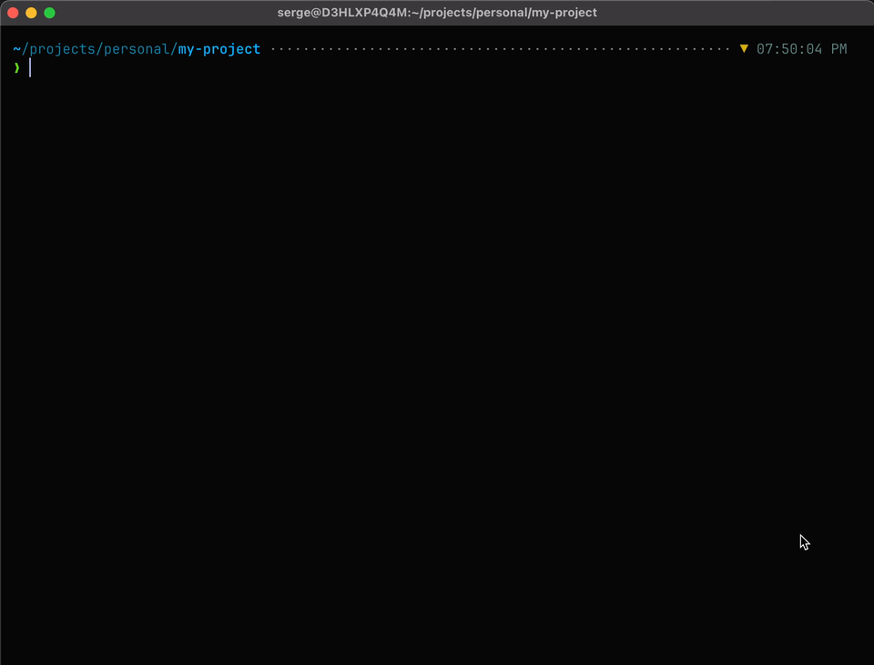

<h1 align="center">🐥 duckrow</h1>

<p align="center"><i>Get your ducks in a row — manage AI agent skills across your team.</i></p>

<p align="center">
  
</p>

AI coding agents like Cursor, Claude Code, OpenCode, and GitHub Copilot use **skills** — markdown files that tell them how to behave in your project. Things like code review guidelines, test generation rules, or deployment checklists.

The problem is keeping those skills consistent. When every developer manages skills by hand, they drift between repos, conventions diverge, and nobody knows what's running where.

duckrow fixes this. It gives your team a single way to distribute, install, and pin AI agent skills — across every project and every developer.

**How it works:**

- **Set up a private registry** — a git repo with a manifest listing your team's approved skills
- **Install skills by name** — `duckrow install --skill code-review` pulls the right version from the registry
- **Pin with a lock file** — every install records the exact git commit in `duckrow.lock.json`, just like `package-lock.json` or `uv.lock`
- **Sync across the team** — teammates run `duckrow sync` and get identical skills, no manual setup
- **Update when ready** — `duckrow outdated` shows what changed, `duckrow update` moves forward

One binary, no dependencies. Works with any git host. Has a nice intuitive TUI.

## Quick Start

```bash
# Install
brew install barysiuk/tap/duckrow

# Add a project
duckrow add ~/code/my-app

# Install a skill
duckrow install acme/skills -d ~/code/my-app

# Teammates sync from the lock file
duckrow sync
```

## Interactive TUI

Run `duckrow` to launch the terminal UI. Browse installed skills, install from your registry, check for updates, and update skills — all without memorizing commands.

<p align="center">
  
</p>

Key actions: navigate with `j`/`k`, preview a skill with `enter`, install with `i`, remove with `d`, update with `u`/`U`, refresh registries with `r`, switch folders with `c`, and open settings with `s`. Press `?` for the full keybinding reference.

The TUI automatically detects available updates for registry-tracked skills and shows update badges inline. Registry data is refreshed asynchronously in the background — the UI is fully interactive from the first frame.

See [docs/tui.md](docs/tui.md) for the full TUI reference.

## CLI

Every action in the TUI also works as a direct command — useful for scripting, CI, or when you already know what you need.

```
$ duckrow add .
Added folder: /Users/me/code/my-app

$ duckrow install vercel/agents -d . --skill code-review
Installed: code-review
  Path: .agents/skills/code-review
  Agents: OpenCode, Codex, Gemini CLI, GitHub Copilot

$ duckrow status .
Folder: /Users/me/code/my-app [tracked]
  Skills (1):
    - code-review [.agents/skills/code-review]
      Review code changes

$ duckrow uninstall code-review -d .
Removed: code-review
```

## Supported Agents

duckrow detects which agents you use and installs skills to the right directories automatically.

| Agent | Skills Directory | Type |
|-------|-----------------|------|
| OpenCode | `.agents/skills/` | Universal |
| Codex | `.agents/skills/` | Universal |
| Gemini CLI | `.agents/skills/` | Universal |
| GitHub Copilot | `.agents/skills/` | Universal |
| Claude Code | `.claude/skills/` | Symlinked |
| Cursor | `.cursor/skills/` | Symlinked |
| Goose | `.goose/skills/` | Symlinked |
| Windsurf | `.windsurf/skills/` | Symlinked |
| Cline | `.cline/skills/` | Symlinked |

**Universal** agents share `.agents/skills/` — the skill is written there once.

**Symlinked** agents have their own directory. duckrow creates symlinks from their directory back to `.agents/skills/`, so each skill exists in one place but works everywhere.

## Commands

For the full command reference with all flags and examples, see [docs/cli_reference.md](docs/cli_reference.md).

### Folder Management

```
duckrow add [path]              Add a folder to the tracked list (default: current dir)
duckrow remove-folder <path>    Remove a folder from the tracked list
duckrow folders                 List all tracked folders
```

### Skills

```
duckrow install [source]        Install skill(s) from a source or registry
duckrow uninstall <skill-name>  Remove an installed skill
duckrow uninstall-all           Remove all installed skills
duckrow status [path]           Show skills and agents for tracked folders
duckrow sync                    Install skills from lock file at pinned commits
duckrow outdated                Show skills with available updates
duckrow update [skill-name]     Update skill(s) to the available commit
```

### Registries

```
duckrow registry add <url>      Add a private skill registry
duckrow registry list           List configured registries
duckrow registry refresh [name] Refresh registry data (all if no name given)
duckrow registry remove <name>  Remove a registry
```

### Install Sources

The `install` command accepts multiple source formats:

```bash
duckrow install owner/repo                    # GitHub shorthand
duckrow install owner/repo@skill-name         # Specific skill from a repo
duckrow install https://github.com/owner/repo # Full URL
duckrow install git@host:owner/repo.git       # SSH clone URL
duckrow install --skill go-review             # Install from configured registries
```

**Flags:**

| Flag | Short | Description |
|------|-------|-------------|
| `--dir` | `-d` | Target directory (default: current directory) |
| `--skill` | `-s` | Install only a specific skill by name |
| `--registry` | `-r` | Registry to search (with `--skill`, no source) |
| `--internal` | | Include internal (hidden) skills |
| `--agents` | | Comma-separated agent names for symlinks |
| `--no-lock` | | Skip writing to the lock file |

## Folders

Folders are bookmarks for your projects. Add any directory on your system and duckrow will track which skills and agents are active there. This gives you a single view across your entire file system — no matter how many repos you work in.

```bash
duckrow add ~/code/frontend
duckrow add ~/code/backend
duckrow add ~/code/infra
```

Once tracked, you can check the state of every project at a glance with `duckrow status`, or switch between them in the TUI with a single keystroke. When your team approves a new skill, you can install it across multiple projects from one place instead of repeating the work in each repo.

## Private Registries

Teams can maintain a curated catalog of approved skills using a private git repository. A registry is just a git repo with a `duckrow.json` manifest at the root.

### Setting up a registry

Create a git repository with a `duckrow.json` file:

```json
{
  "name": "my-org",
  "description": "Our team's approved skills",
  "skills": [
    {
      "name": "code-review",
      "description": "Review code with our style guidelines",
      "source": "github.com/my-org/skills/code-review",
      "commit": "a1b2c3d4e5f6789012345678901234567890abcd"
    },
    {
      "name": "pr-guidelines",
      "description": "PR description and review standards",
      "source": "github.com/my-org/engineering-skills"
    }
  ]
}
```

### Using a registry

```bash
# Add by any git URL your machine can clone
duckrow registry add git@github.com:my-org/skill-registry.git
duckrow registry add https://github.com/my-org/skill-registry.git

# List registries and their skills
duckrow registry list --verbose

# Pull the latest changes
duckrow registry refresh

# Remove when no longer needed
duckrow registry remove my-org
```

Authentication is handled by git — if you can `git clone` the URL, duckrow can use it.

## How Skills Work

A skill is a directory containing a `SKILL.md` file with YAML frontmatter and markdown instructions for the AI agent:

```markdown
---
name: code-review
description: Review code changes
metadata:
  version: "1.0.0"
  author: my-org
---

Your skill instructions go here...
```

When you run `duckrow install`, duckrow:

1. Clones the source repo
2. Walks the directory tree to discover all `SKILL.md` files
3. Copies each skill to `.agents/skills/<name>/` (the canonical location)
4. Creates symlinks in each requested agent's skills directory (e.g., `.cursor/skills/<name>/` -> `.agents/skills/<name>/`)
5. Records the exact git commit in `duckrow.lock.json`

This means each skill exists once on disk but is available to every agent.

Skills can also be installed directly from a configured registry by name, without knowing the source repo — see [docs/skill_install.md](docs/skill_install.md) for the full details on discovery, installation, and the registry workflow.

## Lock File

Every `duckrow install` records the exact git commit in `duckrow.lock.json`. Commit this file to version control so your team gets reproducible skill installations.

```bash
# Teammates clone the repo and run sync to get identical skills
duckrow sync

# Check which skills have newer commits available
duckrow outdated

# Update a specific skill (or all at once)
duckrow update go-review
duckrow update --all
```

See [docs/lock-file.md](docs/lock-file.md) for the full lock file reference.

## Configuration

duckrow stores its configuration at `~/.duckrow/config.json`:

```json
{
  "folders": [
    { "path": "/Users/me/code/my-app" },
    { "path": "/Users/me/code/other-project" }
  ],
  "registries": [
    {
      "name": "my-org",
      "repo": "git@github.com:my-org/skill-registry.git"
    }
  ]
}
```

Registry clones are cached at `~/.duckrow/registries/`.

## License

[MIT](LICENSE)
