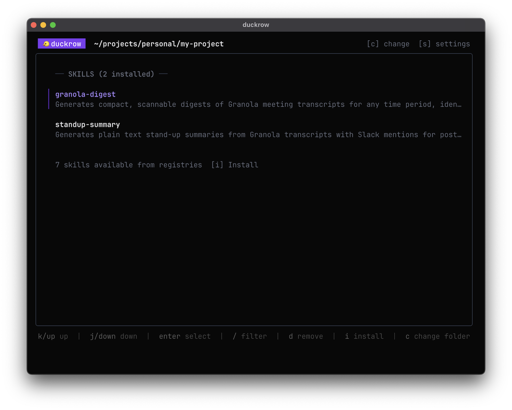

# Terminal UI

duckrow includes an interactive terminal UI built with [Bubble Tea](https://github.com/charmbracelet/bubbletea). Launch it by running `duckrow` without any subcommands.

  

## Layout

The TUI uses a bordered panel layout:

- **Content panel** — the main area showing the active view
- **Sidebar** (right) — a fixed 38-column panel titled "Info" showing the current folder path, bookmark status, and detected systems. The sidebar is visible only in the folder view and hides automatically when the terminal is too narrow.
- **Status bar** (bottom) — a single-line bar with three zones: transient messages (left), help keybindings (center), and background task spinner (right)

## Views

The TUI has several views you navigate between:

| View | Purpose | Enter via |
|------|---------|-----------|
| **Folder** | Main view — shows installed skills, MCPs, and agents for the active folder | Default on launch |
| **Bookmarks** | Switch between bookmarked folders | `b` from folder view |
| **Install** | Browse and install registry skills or MCPs | `i` from folder view |
| **Settings** | Manage registries | `s` from folder view |
| **Preview** | Read a skill's SKILL.md content | `enter` on a skill |

## Keybindings

### Folder View (Main)

The folder view uses **tabs** to switch between **Skills**, **MCP Servers**, and **Agents**. Each tab has its own independent list with filtering. Press `Tab` / `Shift+Tab` to switch tabs.

| Key | Action | Notes |
|-----|--------|-------|
| `j` / `k` | Move up/down | Arrow keys also work |
| `Tab` / `Shift+Tab` | Switch tab | Cycles between Skills, MCP Servers, and Agents tabs |
| `enter` | Preview skill | Opens SKILL.md in a scrollable view (Skills tab only) |
| `/` | Filter | Type to search, `esc` to clear |
| `d` | Remove item | Removes selected skill, MCP, or agent; confirmation prompt before removal |
| `u` | Update skill | Only shown when the selected skill has an update (Skills tab only) |
| `U` | Update all | Only shown when any skill has an update |
| `r` | Refresh | Refreshes registries and reloads data |
| `i` | Install | Opens install picker (requires configured registries) |
| `b` | Bookmarks | Opens bookmarks view |
| `s` | Settings | Opens registry management |
| `q` | Quit | `ctrl+c` also works |

### Bookmarks

The bookmarks view is a full-screen list with built-in filtering. If duckrow was launched from a non-bookmarked folder, that folder always appears at the top of the list so you can navigate back to it.

| Key | Action |
|-----|--------|
| `j` / `k` | Move up/down |
| `enter` | Select folder |
| `/` | Filter folders |
| `b` | Bookmark current directory |
| `d` | Remove bookmark |
| `esc` | Back to folder view |

### Install Picker

The install picker is context-aware: pressing `i` from the **Skills** tab shows only skills, pressing `i` from the **MCP Servers** tab shows only MCPs, and pressing `i` from the **Agents** tab shows only agents.

| Key | Action |
|-----|--------|
| `j` / `k` | Move up/down |
| `enter` | Install selected skill, MCP, or agent |
| `/` | Filter |
| `esc` | Back to folder view |

**Skill install wizard:** after selecting a skill, a system selection step appears if non-universal systems are detected. Use `space`/`x` to toggle systems, `a` to select all/none, and `enter` to proceed with installation.

**Agent install wizard:** after selecting an agent, a system selection step appears for choosing which agent-capable systems to target (Claude Code, OpenCode, GitHub Copilot, Gemini CLI). Use `space`/`x` to toggle systems, `a` to select all/none, and `enter` to proceed with installation.

**MCP install wizard:** selecting an MCP opens a multi-step wizard:

1. **System selection** — choose which MCP-capable systems to configure (OpenCode, Claude Code, Cursor, GitHub Copilot). Detected systems are pre-selected; toggle with `space`/`x`.
2. **Preview** — shows the MCP details and the status of any required environment variables (already set, missing, etc.)
3. **Env var entry** — if required env vars are missing, you are prompted to enter each value one at a time. After entering a value, choose whether to save it to the **project** `.env.duckrow` or to the **global** `~/.duckrow/.env.duckrow`.
4. **Install** — duckrow writes the MCP config into each system's config file and updates the lock file.

### Settings

| Key | Action |
|-----|--------|
| `j` / `k` | Move up/down |
| `enter` | Add a new registry |
| `d` | Remove selected registry |
| `r` | Refresh selected registry |
| `esc` | Back to folder view |
| `q` | Quit |

Adding a registry opens a wizard: enter the registry URL, then duckrow clones it and shows the result. If cloning fails, you can edit the URL or retry.

### Skill Preview

| Key | Action |
|-----|--------|
| `j` / `k` | Scroll up/down |
| `esc` | Back to folder view |

## Sidebar

The sidebar panel (titled "Info") is shown to the right of the folder view when the terminal is wide enough. It displays:

- **Folder:** the shortened path of the active folder
- **Bookmarked:** Yes or No (with an italic `([b] to bookmark)` hint when not bookmarked)
- **Systems:** list of detected systems in the active folder (based on config artifacts like `.cursor/`, `codex.md`, `.github/copilot-instructions.md`, etc.)

## Update Detection

The TUI detects available updates for installed skills by comparing the commit in your lock file (`duckrow.lock.json`) against the commit in your configured registries.

### What gets checked

Only **registry-tracked skills** are checked for updates. Skills installed from ad-hoc sources (direct URLs, GitHub shorthand) without a matching registry entry will not show update badges.

### How it works

1. On startup, duckrow loads the registry commit map from cached data (instant, no network)
2. In parallel, an async registry refresh runs in the background — pulling latest registry data and [hydrating unpinned commits](lock-file.md#commit-hydration)
3. A spinner with "fetching" label appears in the status bar while this runs
4. When the refresh completes, the skill list updates automatically with any new update indicators

The TUI remains fully interactive during the background refresh.

### Visual indicators

When updates are available:

- The Skills tab label shows the count with a yellow down arrow: `Skills (3 ↓2)`
- Each skill with an update shows a yellow `↓` next to its name
- The `u` and `U` keybindings appear in the help bar

### Updating skills

**Single skill** — select the skill with an update and press `u`. A confirmation dialog shows the old and new commit hashes (e.g., `Update go-review? (a1b2c3d -> f9e8d7c)`). Confirm to proceed.

**All skills** — press `U` to update all skills with available updates at once. A confirmation dialog shows the total count. Updates are applied sequentially; if one fails, the rest continue. A status bar message shows the result (e.g., `Updated 3 skills` or `Updated 2 skills, 1 errors`).

Updates preserve existing system symlinks — no system selection is needed during updates.

### Refreshing

Press `r` in the folder view to manually trigger a registry refresh. This:

1. Pulls latest changes for all configured registries (`git pull`)
2. Hydrates unpinned skill commits (shallow clone + `git log`)
3. Rebuilds the commit map
4. Reloads folder data

The refresh runs asynchronously with a spinner in the status bar. You can continue browsing while it runs.

> **Note:** Update detection in the TUI currently applies to skills only. Agent updates are fully supported via the CLI (`duckrow agent outdated`, `duckrow agent update`) but the TUI does not yet display update badges or offer inline update actions for agents. This is a known limitation planned for a future release.

## Status Bar

The status bar occupies the bottom line of the terminal and has three zones:

- **Left** — transient messages (success in green, error in red, warning in amber) that auto-dismiss after a few seconds
- **Center** — help keybindings for the active view (hidden while a transient message is visible)
- **Right** — background task counter with a spinner dot (e.g., "fetching" during registry refresh)

## MCP Management

The folder view shows installed MCPs in the **MCP Servers** tab. Each row shows the MCP name, its description (if available from the registry), and the systems it is configured for.

### Installing MCPs

Press `i` from the MCP Servers tab to open the install picker filtered to MCPs. Select an MCP and follow the multi-step install wizard (see [Install Picker](#install-picker) above).

### Removing MCPs

Switch to the MCP Servers tab with `Tab`, select the MCP, and press `d`. A confirmation prompt shows before removal. duckrow removes the MCP entry from all system config files that contain it and updates the lock file.

### Env Var Entry Flow

When installing an MCP that requires environment variables (e.g., API keys, database URLs), the TUI prompts you to enter values for any that are not already set:

1. The preview screen lists each required env var and its current status (set or missing)
2. For each missing var, an input field appears with the var name as the prompt
3. After entering a value, choose the save location:
   - **Project** — saved to `.env.duckrow` in the project root (gitignored automatically)
   - **Global** — saved to `~/.duckrow/.env.duckrow` (applies to all projects)
4. The TUI proceeds to install once all vars are handled

If you skip entering a value, installation proceeds with a warning. You can add the value to `.env.duckrow` manually at any time before running the MCP.

## Agent Management

The folder view shows installed agents in the **Agents** tab. Each row shows the agent name, its description, and the systems it is installed for.

### Installing Agents

Press `i` from the Agents tab to open the install picker filtered to agents. Select an agent and follow the system selection wizard (see [Install Picker](#install-picker) above).

### Removing Agents

Switch to the Agents tab with `Tab`, select the agent, and press `d`. A confirmation prompt shows before removal. duckrow removes the agent file from all agent-capable systems and updates the lock file.
